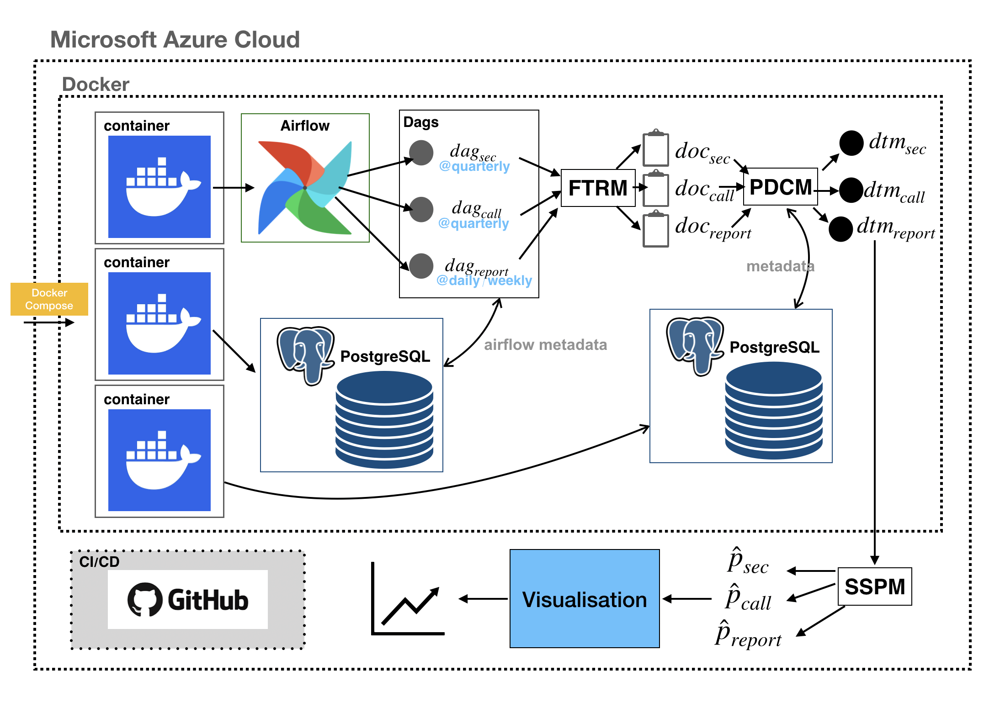

# README: real-time-sent-airflow
 
## 1. Why did you start your project?

This project was initiated in response to the increasing importance of real-time sentiment analysis in financial markets. As a retail investor with five years of experience and a 7.5% compound annual growth rate, I encountered firsthand how sensitive assets like Nvidia and Bitcoin are to sentiment shocks. Existing systems failed to capture the breadth and speed of multi-source financial sentiment. This gap motivated the development of an end-to-end, real-time sentiment scoring system capable of integrating multiple perspectives from financial text—such as regulatory filings, earnings call transcripts, and expert analysis reports—for better forecasting of stock returns and volatility.

## 2. What issues did you find technically and in a domain context?

### Domain Challenges:
- Financial sentiment is fragmented across multiple textual sources and stakeholder viewpoints.
- Existing sentiment systems often focus only on one source (e.g., news) and ignore broader market voices.

### Technical Challenges:
- **Scalability**: Handling 300,000+ documents (~1.5 billion tokens) across different formats and APIs.
- **Orchestration**: Building a real-time system that automates data collection, preprocessing, and model inference.
- **Supervision**: Labeling sentiment metrics for both return and volatility without human annotation.
- **Efficiency**: Real-time preprocessing and data transformation under heavy computational constraints.

## 3. What solutions did you consider?

- **Lexicon-Based vs. Machine Learning Approaches**: Lexicon methods offer transparency but lack nuance. ML models, particularly supervised learning with financial labels, provide better predictive power.
- **Sequential vs. Parallel Data Processing**: Given the volume of data, a parallel and distributed system using Apache Spark and Dockerized pipelines was explored.
- **Single-Source vs. Multi-Source Input**: Initial implementations using only 10-K filings (Minf1) were expanded in Minf2 to include earnings calls and expert reports for better performance and robustness.
- **Cloud-Hosted vs. Local Deployment**: Azure Cloud was chosen for scalability, supported by Docker and Apache Airflow for CI/CD and orchestration.

## 4. What is your final decision among solutions?

The final solution is a real-time, fully automated, and multi-source sentiment scoring system deployed on Microsoft Azure.


It comprises:

- **FTRM (Financial Text Retrieval Model)**: Fetches data from EDGAR, Seeking Alpha, and APIs.
- **PDCM (Parallel Data Construction Model)**: Uses Apache Spark to transform and structure data efficiently.
- **SSPM (Sentiment Score Prediction Model)**: Produces return- and volatility-predictive sentiment scores using a supervised model adapted from Zheng et al.’s lexicon learning method.

This system not only supports real-time decision-making for traders and analysts but also provides a transparent, extensible, and scalable framework for future research and deployment.


## How to Run the System

### 1. Activate the Environment
```bash
conda activate seanchoi
```

### 2. Set Up Dependencies  
If the system hasn't been set up yet, choose one of the following methods to install dependencies.  
> **Recommended**: Option 2 (Docker image)

**Option 1: Install Locally**
```bash
pip download --dest /data/seanchoi/airflow/airflow_docker/deps -r /data/seanchoi/airflow/airflow_docker/requirements.txt --use-deprecated=legacy-resolver
```

**Option 2: Load Prebuilt Docker Image**
```bash
docker load -i /data/seanchoi/airflow/airflow_docker/seanchoi_image.tar
```

> _Note for Hao_: You can skip this step if you're testing the system on the server — the setup and image are already in place.

### 3. Launch the System
Navigate to the project directory and start the services:
```bash
cd /data/seanchoi/airflow
docker compose up
```
(Optional) If an image is not built, build an image first:
```bash
docker compose build
```

(Optional) If the system is already running, stop it first:
```bash
docker compose down
```

### 4. Access the Airflow UI
Open in browser:
```
http://20.77.80.201:3000/home
```
Login credentials:
- **Username**: `admin`
- **Password**: `admin`

---

## Data Directory Structure

Root path:  
```
/data/seanchoi/airflow/data/SP500/
```

```
├── AnalysisReports/
├── constituents/
│   ├── firms/
│   └── market/
├── logs/
├── NASDAQ100/
└── SP500/
    ├── calls/
    │   ├── firm/
    │   └── market/
    ├── reports/
    │   ├── firm/
    │   └── market/
    ├── sec/
        ├── firm/
        └── market/
```

---

## Folder: `firm/`
Contains data for **individual S&P 500 companies**.

### Subfolders:
- `company_df/` — Firm-specific data by CIK (e.g., `0001045810/`)
- `dtm/` — Document-Term Matrices
  - `_SUCCESS`: Spark job completion marker  
  - `.parquet` files: DTM data
- `filtered/` — Preprocessed datasets (e.g., `batch_filtered_0.parquet`) which remains only active SP500 firm per year. The output of SP500 Dynamism filter (Please check the Financial Text Retrieval Model at the thesis)
- `html/` — SEC filings in HTML format
- `intermediate/` — Temporary processing outputs
- `outcome/` — Final metrics
  - `mod_sent_ret.csv`: Sentiment-based returns
  - `mod_sent_vol.csv`: Sentiment-based volatility
- `processed/` — Clean datasets ready for modeling
- `txt/` — Plain text SEC filings
- `json/` — Transcripts and Reports in JSON format

---

## Folder: `market/`
Contains **aggregated data across the S&P 500**.

Structure mirrors the `firm/` folder:
- `company_df/`: Aggregated data by CIK
- `dtm/`, `filtered/`, `html/`, `intermediate/`, `outcome/`, `processed/`, `txt/`, `json/`: Same function as in `firm/`

---

##  How to Use or Modify the Data

### Adding New Data
Place raw files into:
- `html/` for HTML filings
- `txt/` for plain text

### Processing Data
- Store intermediate results in `intermediate/`, `filtered/`
- Save final metrics in `outcome/`

### Analyzing Results
Use:
- `outcome/mod_sent_ret.csv` and  
- `outcome/mod_sent_vol.csv`  
for analysis and plotting.

### Debugging
Check `filtered/` and `intermediate/` to verify preprocessing steps and troubleshoot issues.


## Folder: `constituents/`
Root path:  
```
/data/seanchoi/airflow/data/constituents/
```

### 1. Subfolder: `firms/`
- **nvidia_constituents_final.csv**
  - Final processed list of NVIDIA-related firms.
  - **Columns**: CIK, Ticker, Company Name, Sector, Inclusion Date, Exclusion Date
  - **Use Case**: Firm-level analysis of NVIDIA-related companies.

- **nvidia_constituents.csv**
  - Raw unfiltered list of NVIDIA-related firms.
  - **Columns**: CIK, Ticker, Company Name, Sector
  - **Use Case**: Starting point for preprocessing NVIDIA data.

### 2. Subfolder: `market/`
- **QQQ_constituents_test.csv**
  - Test set of NASDAQ-100 constituents.
  - **Columns**: CIK, Ticker, Company Name, Sector
  - **Use Case**: Testing NASDAQ-100 workflows.

- **sp500_constituents.csv**
  - Current list of S&P 500 firms.
  - **Columns**: CIK, Ticker, Company Name, Sector
  - **Use Case**: Current firm-level S&P 500 analysis.

- **sp500_total_constituents.csv**
  - Historical list including past and present S&P 500 members.
  - **Columns**: CIK, Ticker, Company Name, Sector, Inclusion Date, Exclusion Date
  - **Use Case**: Historical S&P 500 analysis.

- **sp500_union_constituents.csv**
  - Unified dataset of all S&P 500 members.
  - **Columns**: CIK, Ticker, Company Name, Sector
  - **Use Case**: Comprehensive S&P 500 constituent analysis.

- **top10_QQQ_constituents_test.csv**
  - Test dataset for top 10 NASDAQ-100 firms.
  - **Columns**: CIK, Ticker, Company Name, Sector
  - **Use Case**: Workflow testing on top NASDAQ firms.

- **top10_QQQ_constituents.csv**
  - Top 10 NASDAQ-100 firms by market cap or other criteria.
  - **Columns**: CIK, Ticker, Company Name, Sector
  - **Use Case**: Targeted analysis of major NASDAQ constituents.


## Core Code at Plugins Directory Structure

The plugins directory contains custom modules, scripts, and utilities that extend the functionality of the real-time system. It is organized into main subfolders:

```
/data/seanchoi/airflow/plugins
├── __init__.py
├── common/
├── packages/
└── shell/
```

### 1. Folder: `common/`
Contains shared utility functions and scripts used across the system.

#### Key Files:
- `__init__.py`: Initializes the module
- `common_func.py`: General utilities (e.g., file importers, SFTP handlers)
- `sec10k_item1a_extractor.py`: Extracts "Item 1A: Risk Factors" from SEC filings (text + HTML)
- `time_log_decorator.py`: Decorator to log function execution times

#### Key Functions:
- `process_files_for_cik`: Processes filings for a specific CIK
- `process_files_for_cik_with_italic`: Handles italicized SEC content
- `save_error_info`: Logs errors during processing

#### Use Cases:
- Use `common_func.py` for file operations
- Use `sec10k_item1a_extractor.py` for SEC section extraction and preprocessing

### 2. Folder: `packages/`
Specialized modules organized by functionality

#### Subfolders:
- **FTRM/** (Financial Text Retrieval Model)
  - `sec_crawler.py`: Crawls SEC filings
  - `extract_report_ids.py`: Retrieves report IDs
  - `annual_report_reader.py`: Preprocesses annual reports
  - **Use case**: Retrieving and preparing financial documents

- **PDCM/** (Processing and Document Construction Module)
  - `constructDTM.py`: Builds Document-Term Matrices
  - `vol_reader_fun.py`: Processes volatility and returns
  - **Use case**: Preprocessing and feature construction

- **SSPM/** (Sentiment and Signal Processing Module)
  - `model.py`: Trains sentiment models; Kalman filters
  - `sent_predictor_firm.py`: Predicts sentiment at firm-level
  - `sent_predictor_market_deprecated.py`: (Deprecated) Market-level sentiment. Check the local version which is used in the system (sec_sent_predictor_local.py at /data/seanchoi/SSPM_local)
    
  - **Use case**: Sentiment modeling and signal generation
